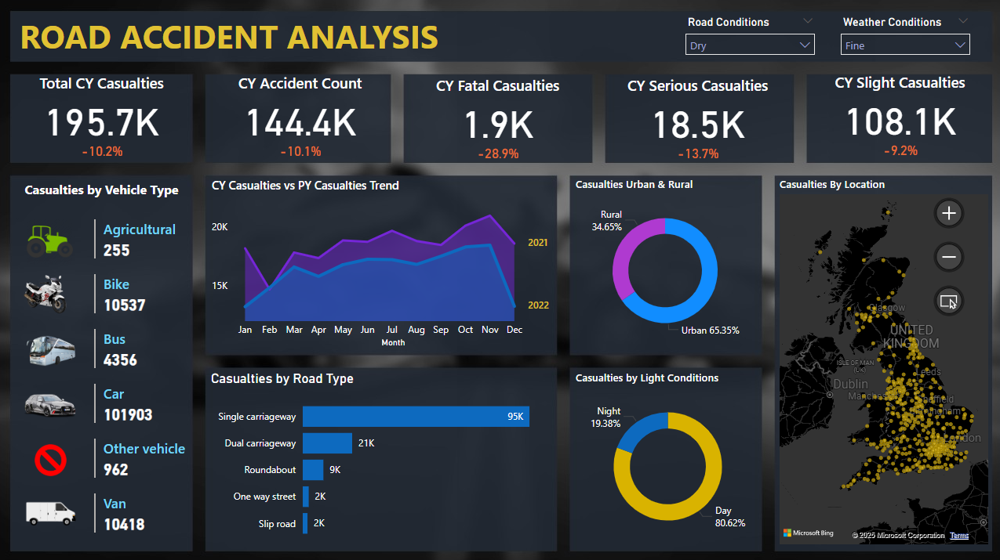

# 🚧 UK Road Accident Analysis

A data analysis project exploring patterns in UK road accidents with a focus on casualties, severity, vehicle types, and environmental conditions. Built using Power BI and DAX.

---

## 📈 Overview

This project analyzes UK Department for Transport road accident datasets to identify trends, highlight risk factors, and provide insights into road safety. It includes visual reports and key metrics for better understanding the causes and conditions surrounding road traffic casualties.

---

### 📌 Key KPIs

- **Total Current Year Casualties**  
Total number of individuals injured or killed in road accidents during the current year.

- **Year-over-Year Casualty Rate (%)**  
Percentage change in casualties compared to the previous year.

- **Total Accident Count**  
Total number of reported road accidents regardless of severity.

- **Casualties by Severity**  
Breakdown of casualties into Fatal, Serious, and Slight categories.

- **Urban vs Rural Casualties**  
Comparison of casualty counts between urban and rural accident locations.

### ⚠️ Casualties by Severity
- Categorized as:
- Fatal
- Serious
- Slight

### 📍 Casualties by Location
- Geographical breakdown to identify high-risk areas (e.g., region, county, city).

### 🏙️ Urban vs 🌾 Rural Casualties
- Comparative analysis of casualties in urban vs. rural environments.

### 🌞 Day vs 🌙 Night Casualties (Light Conditions)
- Impact of lighting:
- Daylight
- Darkness (with or without street lighting)

### 🚗 Casualties by Vehicle Type
- Includes:
- Cars
- Motorcycles
- Bicycles
- Vans
- Agriculture and Others.

### 🌧️ Casualties by Weather Condition
- Weather impact on accidents:
- Fine/Clear
- Rain
- Snow
- Fog/Mist

### 🛣️ Casualties by Road Condition
- Road surface at time of accident:
- Dry
- Wet
- Snow/Ice
---

## 📁 Data Source

- Accident Dataset [click_here](https://github.com/Yam-ghub/AccidentAnalysis/blob/main/Road%20Accident%20Data.xlsx)
- Includes accident, casualty, and vehicle-level data

---

## 🧰 Tools Used

- [Power BI](https://powerbi.microsoft.com/)
- DAX (Data Analysis Expressions)
- Microsoft Excel / CSV

---
